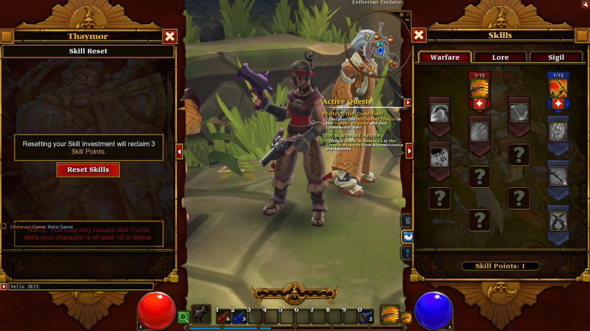

# TL2BetaMiniLobby

TL2BetaMiniLobby is a lightweight lobby server emulator that allows you to play the multiplayer-only beta version of Torchlight 2 released in May 2012 offline. This emulator was tested with version `0.20.8.1`.

Please note that this program implements the bare minimum of functionality needed to run the game and does not support multiplayer.

## Setup

1. Get yourself a copy of Torchlight 2 beta.

2. Make sure you have [.NET 6 runtime](https://dotnet.microsoft.com/en-us/download/dotnet/6.0) installed.

3. Download the latest version of TL2BetaMiniLobby from [releases](https://github.com/Crypto137/TL2BetaMiniLobby/releases).

4. Launch and exit the beta at least once to generate the local settings file.

5. Open `local_settings.txt` located in `%USERPROFILE%\Documents\My Games\Runic Games\Torchlight 2 Beta\save\`.

6. Find the line that says `LOBBYHOST :lobby.runicgames.com` and replace it with `LOBBYHOST :localhost`.

7. Run TL2BetaMiniLobby.

8. Run the game and log in with any username and password.
